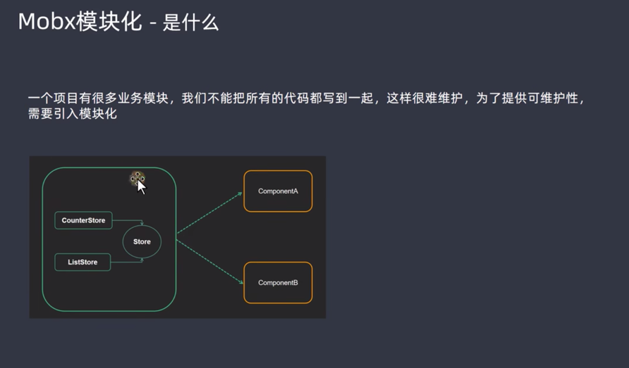
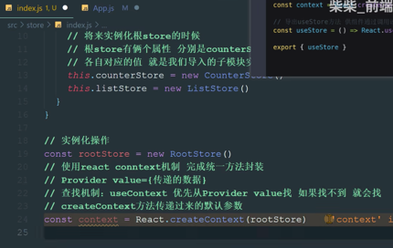

## 搭建过程

### 基本创建
```shell

npx create-react-app mobx-react-app

cd mobx-react-app

yarn add  mobx  mobx-react-lite

```

## 第一个store

实现步骤:

1.定义数据状态（state）

2.数据响应式处理

3.定义action函数(修改数据)

4.实例化并导出实例

```js
//编写第一个mobx store
import {makeAutoObservable} from 'mobx'
class CounterStore{
  //定义数据
  count = 0
  constructor() {
    //将数据弄成响应式
    makeAutoObservable(this)
  }
  //3.定义action函数(修改数据)
  addCount = ()=>{
    this.count++
  }
}

//4.实例化 然后导出给react使用
const counterStore = new CounterStore()

export {counterStore}
```

## 连接React

1.导入实例

2.使用store中实例

3.修改store中数据

4.让组件视图响应数据变化

 ```jsx

// 导入counterStore
import counterStore from './store'
// 导入observer方法
import { observer } from 'mobx-react-lite'
function App() {
  return (
    <div className="App">
      <button onClick={() => counterStore.addCount()}>
        {counterStore.count}
      </button>
    </div>
  )
}
// 包裹组件让视图响应数据变化
export default observer(App)
```

## 计算属性

实现步骤
1. 声明一个存在的数据
2. 通过get关键词 定义计算属性
3. 在 makeAutoObservable 方法中标记计算属性

```js
import { computed, makeAutoObservable } from 'mobx'

class CounterStore {
  list = [1, 2, 3, 4, 5, 6]
  constructor() {
    makeAutoObservable(this, {
      filterList: computed
    })
  }
  // 修改原数组
  changeList = () => {
    this.list.push(7, 8, 9)
  }
  // 定义计算属性
  get filterList () {
    return this.list.filter(item => item > 4)
  }
}

const counter = new CounterStore()

export default counter
```

app.js

```js
//导入 countStore
import {counterStore} from './store/counter'
//导入中间件mobx react
import {observer} from "mobx-react-lite";

function App() {
  return (
    <div className="App">
      {/*使用:  */}
      {counterStore.count}

      {counterStore.filterList.join('-')}
      <button  onClick={counterStore.addCount}>+1</button>
      <button  onClick={counterStore.addList}>修改数组</button>
    </div>
  );
}

export default observer(App);

```

## Mobx模块化







```jsx

import React from 'react'

import counter from './counterStore'
import task from './taskStore'


class RootStore {
  constructor() {
    this.counterStore = counter
    this.taskStore = task
  }
}

//实例化操作,下面是模板代码
const rootStore = new RootStore()

//使用 React conntext机制 完成 统一方法封存
// Provider value = {传递的数据}
//查找机制: useContext 优先中Provider value 查找, 如果找不到就会找 createContext 方法传递过来的默认参数
const context = React.createContext(rootStore)

//这个方法作用: 通过useContext拿到rootStore实例对象 然后返回
//只要在业务组件中 调用useStore() -> rootStore
const useStore = () => React.useContext(context)

export { useStore }
```


## 基础总结


